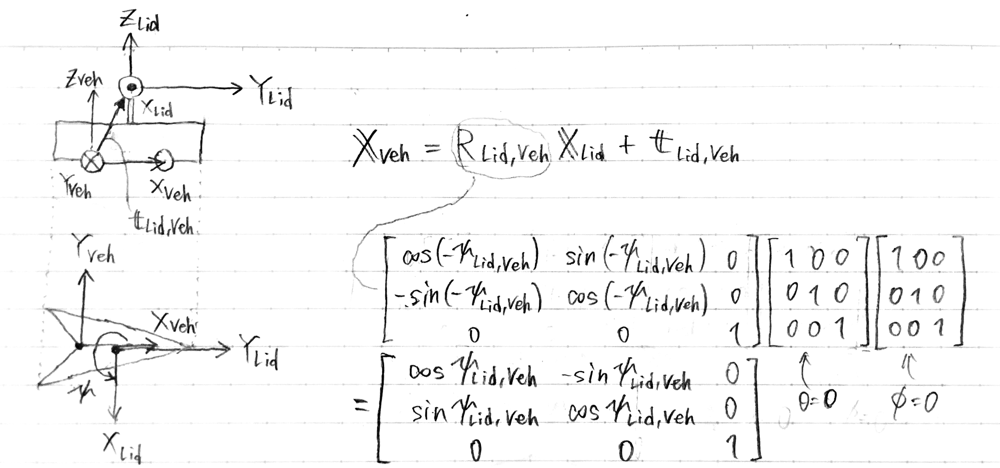
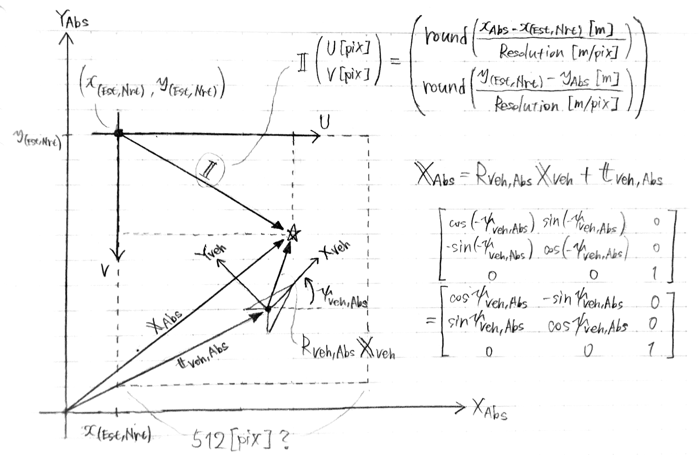
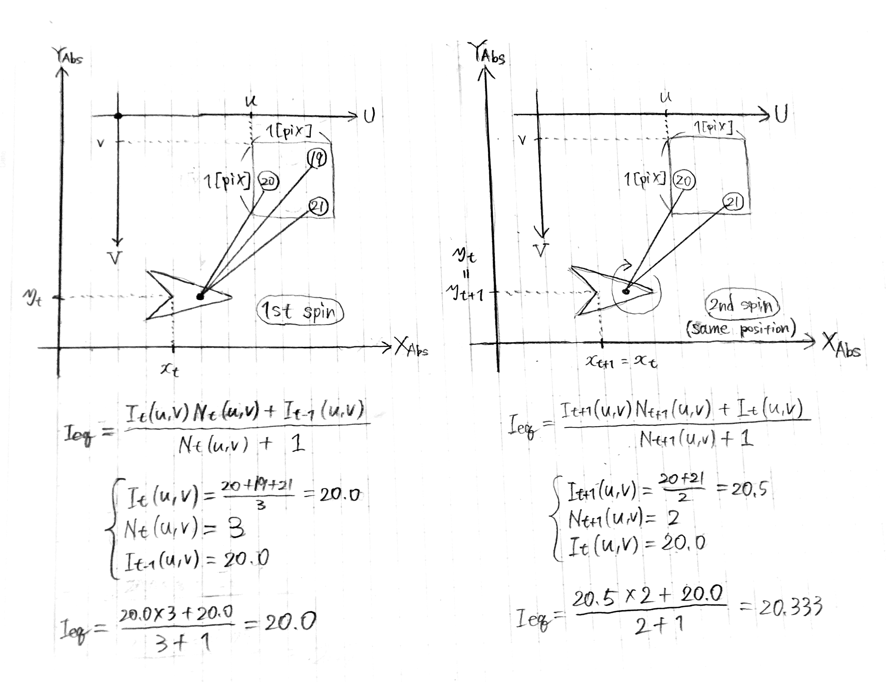
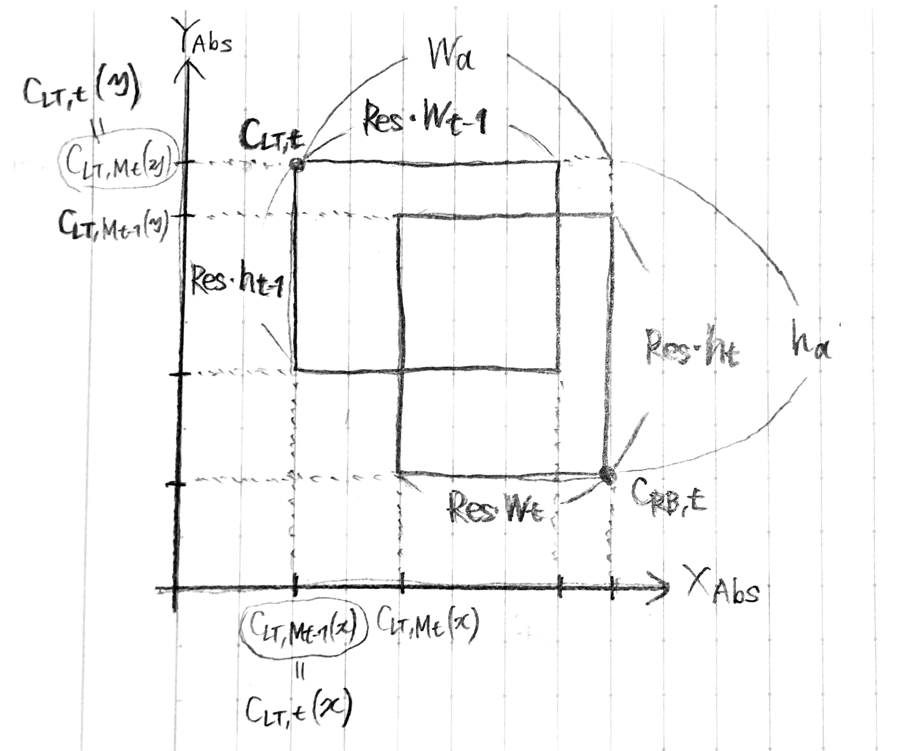
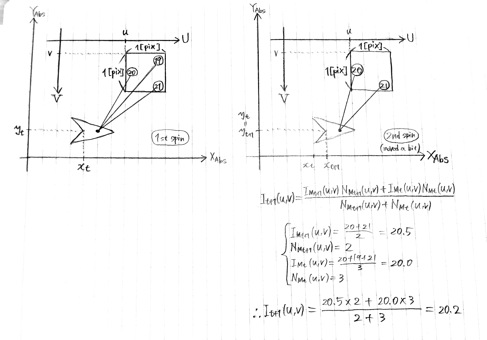
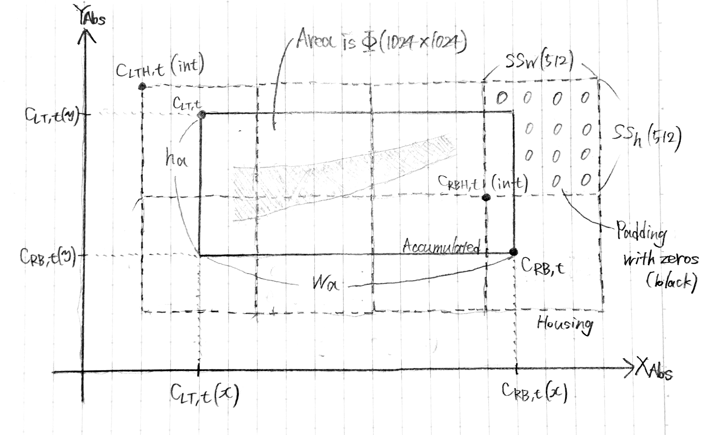
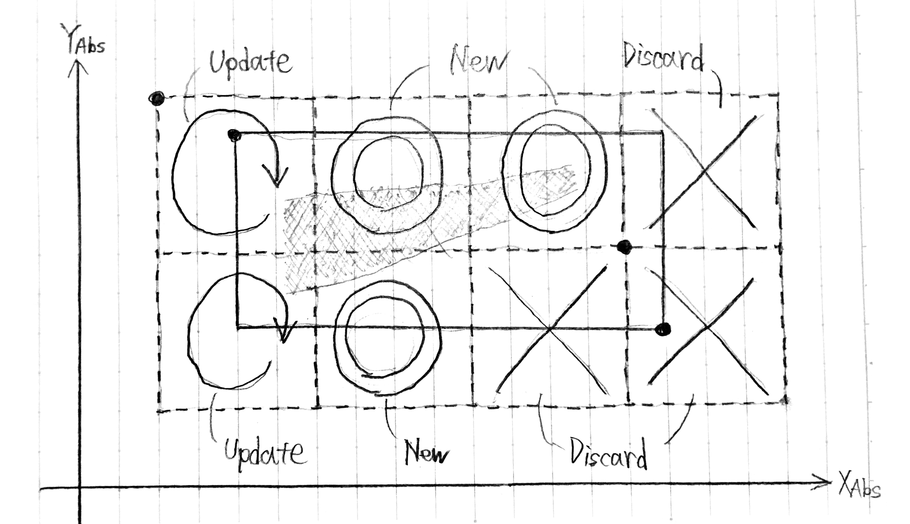
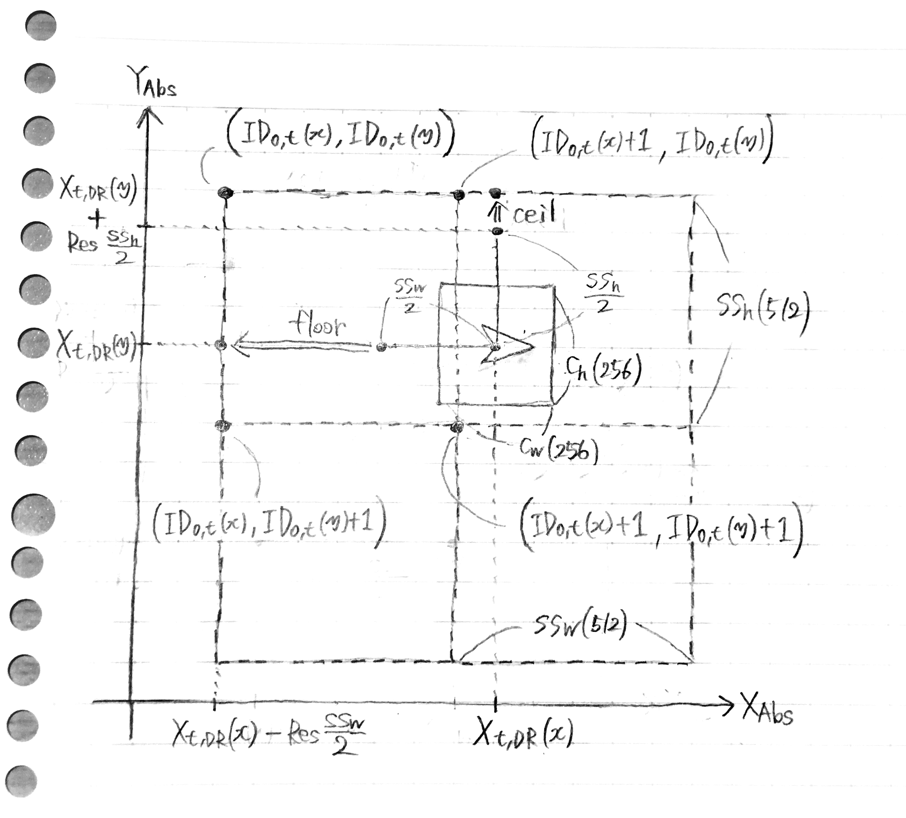
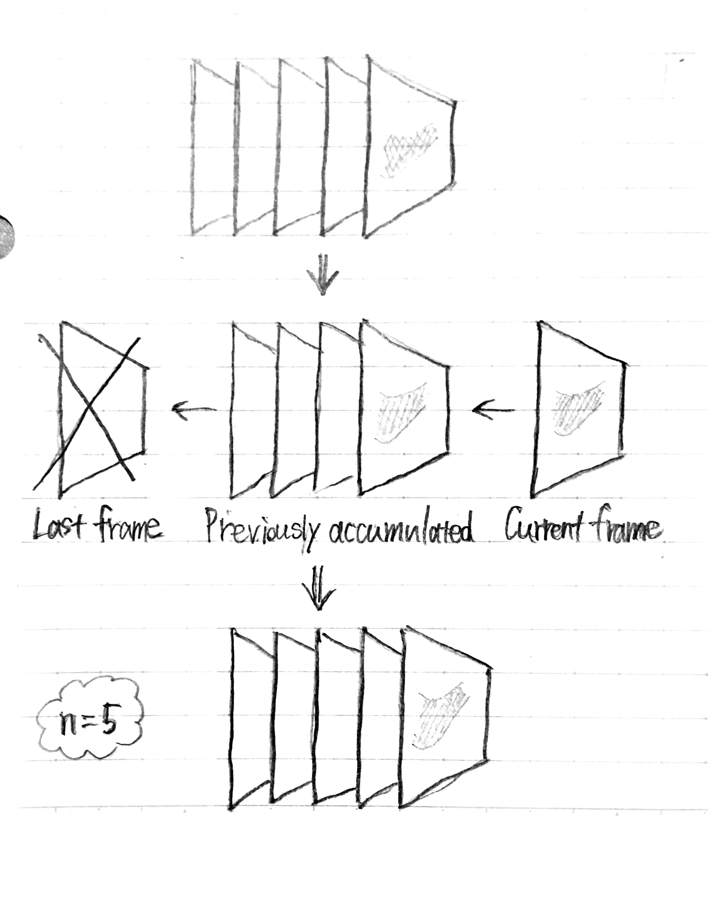

# LIDAR-Data Accumulation Strategy

---

## 1. INTRODUCTION

```
+-- Camera based: Dense information / Needs multiple rides
+-- LIDAR based
    +-- Features: Can't provide stable information / Needs multiple rides
    +-- Intensity: Less affected by environment changes / Single ride is sufficient
```

## 2. ONE MAP FRAME GENERATION

Transition from Lider coordinate ---> to Vehicle coordinate

{ height=80% width=80% }\

Transition from Vehicle coordinate ---> to Absolute (World) coordinate

{ height=80% width=80% }\

The equation of each pixel's intensity level $I_{eq}(u,v)$ in same position is;

$$
I_{eq}(u,v) =
\frac
{I_{new}(u,v) + I_{old}(u,v) * N(u,v)}
{1 + N(u,v)}
$$

{ height=120% width=120% }\

It weights old value $I_{old}(u,v)$ by the number of irradiations $N(u,v)$, which means considering old value $I_{old}(u,v)$ is more trustful than new value $I_{new}(u,v)$. If the equation took the average of the intensity levels, the final value $I_{eq}(u,v)$ would be `20.2` (not `20.083`).

## 3. MULTIPLE FRAMES ACCUMULATION

For all map images and the accumulated map, the top-left corner is considered as a reference.

$$
C_{LT,t}(x) = min(C_{LT,M_{t-1}}(x), C_{LT,M_{t}}(x))
$$
$$
C_{LT,t}(y) = max(C_{LT,M_{t-1}}(y), C_{LT,M_{t}}(y))
$$

{ height=120% width=120% }\

The equation of each pixel's intensity level $I_{t}(u,v)$ between slightly different position is;

$$
I_{t}(u,v) =
\frac
{I_{M_{t}}(u,v) * N_{M_{t}}(u,v) + I_{M_{t-1}}(u,v) * N_{M_{t-1}}(u,v)}
{N_{M_{t}}(u,v) + N_{M_{t-1}}(u,v)}
$$

{ height=120% width=120% }\

In contrast to $I_{eq}(u,v)$, It seems that $I_{t}(u,v)$ just takes average of the intensity levels of each frames (I think).

## 4. LABELING AND SAVING

While accumulating the multiple LIDAR frames, saving procedures will be applied when the size of the accumulated frames exceeds a threshold $\Phi$ (= 1024x1024). The accumulated map image will be padded with pixels that the value is zero (black), so that the hosing map image (= padded map image) can be cut with an integer number of sub-images whose size is $SS_w$ x $SS_h$ (= 512x512).

{ height=80% width=80% }\

The top-left and bottom-right corners of the housing map images are calculated in;

$$
C_{LTH,t}(x) = floor(
  \frac
  {C_{LT,t}(x)}
  {SS_w}
)
$$
$$
C_{LTH,t}(y) = ceil(
  \frac
  {C_{LT,t}(y)}
  {SS_h}
)
$$
$$
C_{RBH,t}(x) = floor(¥
  \frac
  {C_{LT,t}(x) + Rse * w_a}
  {SS_w}
)
$$
$$
C_{RBH,t}(y) = ceil(
  \frac
  {C_{LT,t}(y) - Rse * h_a}
  {SS_h}
)
$$

If the ID of the sub-images in the current hosing map image is already existed, then just update the pixels. The sub-image that has no information (= all black) will be excluded from saving process to save storing size.

{ height=80% width=80% }\

## 5. LOCALIZATION BASED ON THE GENERATED MAP

### A. Map Image Creation

The offset between dead reckoning $X_{t,DR}$ and the actual location is estimated by calculating the cross correlation between LIDAR and map images. The map image is retrieved according to the dead reckoning measurement, and the labelling ID of the current driving area is calculated using;

$$
ID_{0,t}(x) = floor(
  \frac
  {X_{t,DR}(x) - Rse * \frac{SS_w}{2}}
  {SS_w}
)
$$
$$
ID_{0,t}(y) = ceil(
  \frac
  {X_{t,DR}(y) + Rse * \frac{SS_h}{2}}
  {SS_h}
)
$$

The map is created by combining four surrounding sub-images, which are;

* ($ID_{0,t}(x)$, $ID_{0,t}(y)$)
* ($ID_{0,t}(x)+1$, $ID_{0,t}(y)$)
* ($ID_{0,t}(x)$, $ID_{0,t}(y)+1$)
* ($ID_{0,t}(x)+1$, $ID_{0,t}(y)+1$)

{ height=65% width=65% }\

Then, the large map images is cut equally around the vehicle position $X_{t,DR}$ to produce a small map image with size of $C_w$ x $C_h$.

### B. LIDAR Image Creation

LIDAR frames and vehicle (irradiation frames as well) are saved and stacked during the last $n$ frames. The current accumulated LIDAR image ($f$ = $1$ ~ $n$) can be obtained as a combination of the current LIDAR *frame* ($f$ = $1$) and previously *accumulated image* ($f$ = $2$ ~ $n-1$) after removing the pixels of the last frame ($f$ = $n$) in the stack.

\
