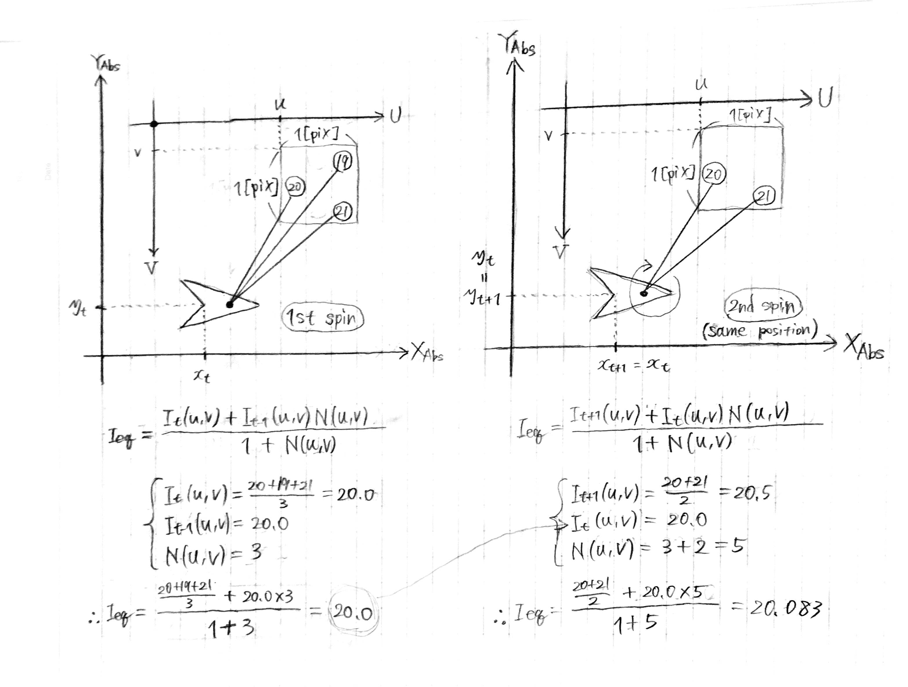

# LIDAR-Data Accumulation Strategy

---

## 1. INTRODUCTION

```
Mapping
|
├── Camera based: Dense infromation / Needs multiple rides
|
└── LIDAR based
    ├── Features mapping: Can't provide stable information / Needs multiple rides
    └── Intensity mapping: Less affected by environment changes / Single ride is sufficient
```

## 2. ONE MAP FRAME GENERATION

Transition from Lider coordinate ---> to Vehicle coordinate

\

Transition from Vehicle coordinate ---> to Absolute (World) coordinate

\

**Q: Is the max value of the Image domain (`U` and `V`) 512[pix]?**

The equation of each pixel's intensity level ${I_eq(u, v)}$ in same position

\

It weights every new value ${I_new(u, v)}$ by the number of irradiations ${N(u, v)}$, which means considering new value ${I_new(u, v)}$ is more trustful than old value ${I_old(u, v)}$. If the equation took the average of the intensity levels, the final value ${I_eq(u, v)}$ would be `20.2` (not `20.333`).

**Q: What does "the defference between the pixel values" mean?**
>"An intuitive solution is to calculate the averaged intensity value based on the number of irradiations ${N(u, v)}$. This solution doesn't take into account the difference between the pixel values."

**Q: What does ${_eq}$ mean in ${I_eq(u, v)}$?**

## 3. MULTIPLE FRAMES ACCUMULATION
